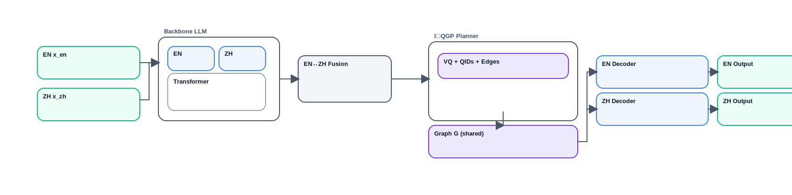
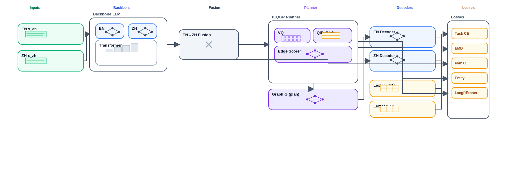

# I‑QGP: Bilingual Reasoning via an Interlingua QID‑Graph Planner

> **Plan once, verbalize twice.**  
> A compact architecture for joint English–Chinese reasoning that plans in a shared, language-agnostic graph and verbalizes separately per language.

<p align="center">
  
  <br/><em>Figure 2 — Inference: build a shared plan once, verbalize to EN & ZH.</em>
</p>

## 🚀 Overview

Large language models often treat English and Chinese reasoning in isolation. **I‑QGP** bridges them with a **shared interlingua planner** grounded in Wikidata-style QIDs and physical units. This enables structural reasoning to transfer across languages—without requiring literal translation.

### ✨ Key Features
- **Cross-lingual plan reuse**: Solve once, answer in both English and Chinese.
- **Grounded reasoning**: Entities and units are linked to QIDs and standardized measurements—reducing hallucinations.
- **Robust to paraphrasing & code-switching**: The underlying plan remains stable under surface variation.
- **Data-efficient**: Leverages bilingual signal without 1:1 parallel CoT data.
- **Interpretable**: Inspect the reasoning plan (nodes + edges), not just final text.

---

## 🧠 How It Works

I‑QGP decouples reasoning into two stages:

1. **Planning (A)**: Constructs a compact, directed acyclic graph (`G`) over grounded entities (QIDs) and units.
2. **Verbalization (B)**: Two lightweight decoders generate English and Chinese outputs **from the same plan**.

<p align="center">
  
  <br/><em>Figure 1 — Training: shared planner + bilingual alignment objectives.</em>
</p>

---

## 🏗️ Architecture Highlights

- **Backbone + Language Adapters**: Shared transformer (e.g., Llama-3-8B, Qwen2-7B) with lightweight EN/ZH adapters.
- **Interlingua QID-Graph Planner**:
  - **VQ Codebook**: Discretizes reasoning states into reusable units.
  - **QID/Unit Pointer**: Links entities & measurements to canonical identifiers.
  - **Edge Scorer**: Builds a DAG representing the reasoning steps.
- **Dual Decoders**: Separate EN/ZH heads verbalize from the same plan.
- **Lexicon Projectors**: Align token semantics across languages in a shared space.

### 🎯 Training Objectives
| Objective | Purpose |
|--------|--------|
| Task CE | Standard answer/rationale supervision |
| Bilingual EMD | Align projected EN/ZH token distributions via Earth Mover’s Distance |
| Plan Contrast (InfoNCE) | Encourage shared planner states across languages |
| Entity/Unit Agreement | Enforce consistent QID/unit grounding |
| Language-Eraser (GRL) | Remove language-specific bias from planner latents |
| Code-Switch Dropout | Augment inputs with random bilingual perturbations (answer-invariant) |

---

## 💡 Why It Works

- **Discrete planning bottleneck** (VQ) promotes reusable reasoning motifs.
- **Optimal transport (EMD)** aligns semantics despite morphological/syntactic differences.
- **Multi-view contrastive learning** treats EN/ZH as two views of one reasoning process.
- **Language-invariant planner** (via GRL) improves cross-lingual transfer.
- **Causal grounding** on QIDs/units suppresses spurious lexical correlations.

---

## 🆕 What’s New

- First to plan over a **QID-anchored interlingua graph** with **discrete reasoning units**.
- **Separate verbalization from a shared plan**—not translation-based.
- Unified objective targeting **structure**, **semantics**, **grounding**, and **language invariance**.

---

## 📊 Evaluation

We go beyond answer accuracy:

- **Plan F1**: Node/edge overlap vs. reference plans.
- **Entity/QID agreement**: Correct linking across languages.
- **Unit consistency**: Normalized unit correctness & conversion.
- **Robustness**: Performance under paraphrase, code-switch, and cross-lingual transfer (e.g., prompt in EN → answer in ZH).

**Recommended datasets**: GSM8K / MGSM, MMLU / CMMLU, C-Eval  
**Gold plans**: Weakly supervised or induced via consistency filtering.

---

## 🛠️ Getting Started

### Minimal Requirements
- Backbone: Any 7–8B instruction-tuned model (e.g., Llama-3-8B, Qwen2-7B)
- Training: LoRA + 4-bit quantization → **single-GPU** feasible
- Planner: Small MLPs for VQ, pointer, and edge scoring (kept compact to avoid leakage)

### Quickstart
1. Install dependencies (PyTorch + HuggingFace stack):
   ```bash
   pip install torch --index-url https://download.pytorch.org/whl/cpu  # pick the wheel that matches your platform
   pip install transformers datasets
   pip install -e .[dev]
   ```
2. Run the MGSM-backed training loop (uses `configs/default.yaml`):
   ```bash
   python scripts/train.py --epochs 1 --device cpu
   ```
3. Execute the pytest suite:
   ```bash
   python -m pytest -q
   ```
   Tests are skipped automatically when PyTorch is unavailable; install torch to exercise the full coverage. To run the synthetic fallback, edit the config to set `dataset.type: synthetic` and `model.use_synthetic_backbone: true`.

For a step-by-step walkthrough covering environment setup, testing, and training, see `docs/experiment_instructions.md`.

### Repo Structure
```
docs/              # Figures & diagrams
iqgp/
  models/          # Backbone, adapters, decoders
  planner/         # VQ, QID pointer, edge scorer
  objectives/      # All training losses (CE, EMD, InfoNCE, etc.)
  data/            # Loaders, lexicon projector, preprocessing
  utils/           # Metrics, logging
configs/           # Example configs (single-GPU, etc.)
scripts/           # Train/eval runners
```

> 💡 Full training/evaluation scripts and configs are in `scripts/` and `configs/`. Deep usage docs are intentionally minimal—see code for details.

---

## ⚠️ Limitations

- **QID/unit coverage**: Performance drops on long-tail entities not in lexicon.
- **Weak supervision risk**: Discrete codes may capture style over logic if plan labels are noisy.
- **License considerations**: Mixing model families requires careful license & tokenizer alignment.
- **Cultural bias**: Shared plans may still reflect dominant cultural priors—audit sensitive outputs.

---

## 🗺️ Roadmap

- [ ] Retrieve-augmented QID/unit suggestion during planning  
- [ ] Constrained decoding from plan `G`  
- [ ] Extend to Japanese, Korean, and beyond  
- [ ] Export plans to GraphML for external tooling

---

## 📚 Citation

If you use I‑QGP in your work, please cite:

```bibtex
@misc{iqgp2025,
  title  = {I-QGP: Bilingual Reasoning via an Interlingua QID-Graph Planner},
  author = {ErrDivine},
  year   = {2025},
  note   = {GitHub repository}
}
```

## 📄 License

Code: **MIT**  
Models & datasets: Respect original licenses.

--- 

Welcome to contribute! 🌍
